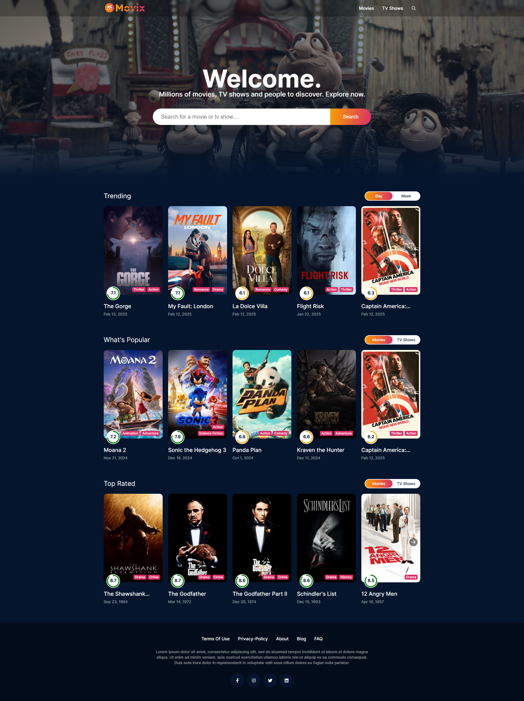

# Movix

Movix is a dynamic web application that provides users with comprehensive information about movies and TV shows. By leveraging the power of The Movie Database (TMDb) API, Movix offers an intuitive and engaging platform for entertainment enthusiasts to explore and discover content.

## Preview



## Features

- **Search Functionality**: Quickly find movies and TV shows by title, genre, or keyword.
- **Detailed Information**: Access in-depth details, including synopses, cast and crew information, release dates, and ratings.
- **Responsive Design**: Enjoy a seamless experience across various devices, thanks to a fully responsive layout.

## Live Site

Check out the live version of the application here: [Movix Live](https://movix-sites.vercel.app/)

## Technologies Used

Movix is built using the following technologies:

- **React**: A JavaScript library for building user interfaces.
- **Redux Toolkit**: A toolset for efficient Redux development, managing the application's state.
- **React Router**: Facilitates dynamic routing within the application.
- **TMDb API**: Provides access to a vast database of movie and TV show information.
- **Axios**: A promise-based HTTP client for making API requests.
- **CSS Modules**: Enables modular and maintainable styling.

## Getting Started

To set up the Movix application locally, follow these steps:

1. **Clone the Repository**:
   ```bash
   git clone https://github.com/FARDIN98/movix.git
   cd movix
   ```

2. **Install Dependencies**:
   Ensure you have [Node.js](https://nodejs.org/) installed. Then, run:
   ```bash
   npm install
   ```

3. **Configure API Access**:
   - Obtain an API key from [TMDb](https://www.themoviedb.org/documentation/api).
   - Create a `.env` file in the root directory and add your API key:
     ```
     REACT_APP_TMDB_API_KEY=your_api_key_here
     ```

4. **Start the Application**:
   ```bash
   npm start
   ```
   The application will run in development mode, typically accessible at `http://localhost:3000`.

## Contributing

Contributions to Movix are welcome! If you'd like to contribute, please follow these steps:

1. Fork the repository.
2. Create a new branch (`git checkout -b feature/YourFeature`).
3. Commit your changes (`git commit -m 'Add YourFeature'`).
4. Push to the branch (`git push origin feature/YourFeature`).
5. Open a Pull Request.

Please ensure your code adheres to the project's coding standards and includes relevant tests.

## License

This project is licensed under the [MIT License](LICENSE).

## Acknowledgements

- [TMDb](https://www.themoviedb.org/) for providing the API and data.
- The open-source community for the tools and libraries that made this project possible.

---


